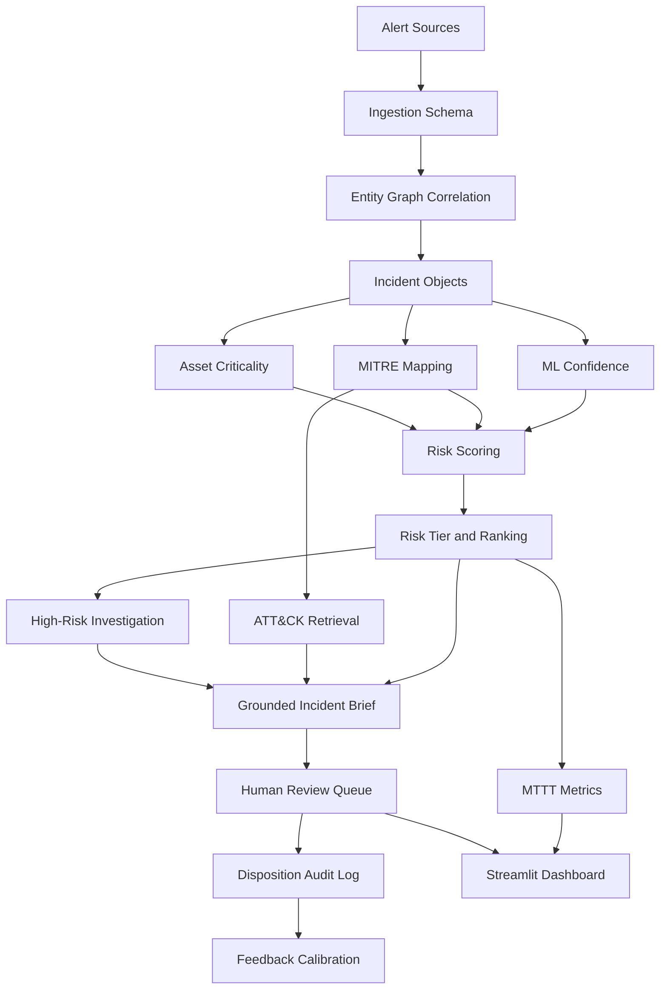

# Full System Architecture — 3,000 Alerts, One Analyst

## 1. Architectural goal

The system is designed as an explainable SOC decision-support pipeline, not an autonomous remediation engine.

Its responsibilities are:

1. ingest alerts
2. establish relationships
3. understand business importance
4. estimate threat likelihood
5. reconstruct the attack story
6. provide analyst-ready evidence
7. measure operational improvement

Its non-responsibility is silently taking destructive action. The human analyst remains responsible for final disposition.

## 2. Logical architecture



## 3. Component layers

### Layer 1 — Data generation or ingestion

Current implementation: `alert_generator.py`.

Production equivalent:

- Microsoft Sentinel
- Splunk
- QRadar
- CrowdStrike
- Defender for Endpoint
- identity providers
- cloud audit logs
- firewall and DNS systems

Every source should be normalized into a common alert contract.

### Layer 2 — Normalized alert contract

The minimum useful alert schema is:

```text
alert_id
timestamp
asset_id
alert_type
src_ip
dst_ip
base_severity
false_positive_rate
technique_id
technique_name
tactic
```

Future fields should include:

```text
user_id
session_id
process_id
parent_process_id
hostname
cloud_account
tenant_id
raw_event_reference
sensor_name
```

Those fields enable stronger graph correlation and evidence linking.

### Layer 3 — Entity graph

The graph contains alerts as events and shared entities as relationship keys.

Current relationship keys:

```text
asset:<asset_id>
connection:<src_ip>→<dst_ip>
```

Future relationship keys:

```text
user:<user_id>
session:<session_id>
process:<process_id>
hostname:<hostname>
cloud-account:<account_id>
```

Edges are limited by a time window. This prevents unrelated activity from becoming one incident forever.

Connected components become candidate incidents.

### Layer 4 — Incident object

An incident is the central object passed through the rest of the system.

Conceptually:

```python
{
    "incident_id": "INC-DC01-A-00001",
    "asset_id": "DC01",
    "assets": ["DC01", "ENG-LAPTOP-114"],
    "alert_ids": ["A-00001", "A-00002"],
    "alert_count": 2,
    "start_time": "...",
    "end_time": "...",
    "techniques": ["T1003.001", "T1046"],
    "tactics": ["Credential Access", "Discovery"],
    "correlation_method": "entity_graph",
    "risk_score": 75.4,
    "risk_tier": "HIGH",
    "brief": "...",
    "investigation_trace": []
}
```

This shared object model makes each stage composable and testable.

## 4. Processing sequence

### Step 1 — Ingest

`generate_alerts()` creates or receives alert dictionaries.

### Step 2 — Correlate

`group_alerts_into_incidents()` builds graph entities, joins nearby events, and returns connected components.

### Step 3 — Enrich

Each alert already contains ATT&CK metadata in the demo. In production, enrichment would query a mapping service or rules engine.

### Step 4 — Score

`score_incident()` combines threat and business context.

### Step 5 — Rank

`score_and_rank()` sorts incidents from highest to lowest score.

### Step 6 — Investigate

Only high and critical incidents receive the bounded investigation trace.

### Step 7 — Summarize

`generate_brief()` creates the next-shift handover explanation.

### Step 8 — Review

`build_review_queue()` creates one human-review row per incident.

### Step 9 — Measure

`summarize_metrics()` compares alert-by-alert review with incident-based review.

### Step 10 — Export

`main.py` writes the outputs consumed by the dashboard and submission package.

## 5. Risk decision architecture

Risk is intentionally multi-dimensional:

```text
Threat evidence
        +
Business impact
        +
Attack progression
        +
Confidence
        ↓
Priority
```

The system avoids these dangerous shortcuts:

- ranking only by alert count
- trusting ML without context
- automatically closing high-risk incidents
- allowing an LLM to invent evidence
- hiding how a score was calculated

## 6. Summary architecture

The summary path is grounded:

```text
Incident techniques/tactics
        ↓
Local ATT&CK retrieval
        ↓
Evidence context
        ↓
Template or optional LLM
        ↓
Analyst brief
```

The brief is still useful with no internet, API key, or downloaded model.

## 7. Human-review architecture

```text
PENDING
   ├── TRUE_POSITIVE
   ├── FALSE_POSITIVE
   ├── ESCALATED
   └── MERGE
```

An analyst action changes the queue, records identity and notes, and appends a feedback row. `MERGE` combines two incidents, rebuilds the alert set, re-scores the combined incident, and marks the workflow as an analyst decision rather than an automatic correlation assumption.

## 8. Dashboard architecture

`dashboard.py` reads generated files rather than recomputing the pipeline in the UI.

This keeps the dashboard fast and separates:

- processing
- persistence
- visualization

The dashboard displays:

- total alerts
- incidents
- noise reduction
- MTTT reduction
- critical and high counts
- cross-asset incidents
- top incidents
- incident details
- correlation method
- impacted assets
- predictions
- review queue
- analytics
- model history
- asset and ATT&CK coverage

## 9. Persistence architecture

The current project uses files for transparency and portability.

| Artifact | Purpose |
|---|---|
| `alerts.csv` | normalized raw alerts |
| `incidents.json` | scored incident records |
| `review_queue.csv` | review state |
| `feedback_log.csv` | analyst feedback audit trail |
| `metrics.json` | dashboard metrics |
| `retrain_history.csv` | model/checkpoint history |
| `severity_model.pkl` | trained CICIDS model bundle |

A production deployment can replace these with:

- PostgreSQL
- Elasticsearch/OpenSearch
- a case-management database
- object storage
- a model registry

## 10. Security and reliability principles

### Explainability

Every score can be decomposed into asset weight, severity, confidence, chain bonus, and volume factor.

### Graceful degradation

The system continues working when:

- the ML model is unavailable
- the external LLM is unavailable
- a reputation provider is unavailable
- graph input is malformed

### Bounded automation

Investigation steps are capped. High-risk decisions remain human-controlled.

### Reproducibility

Alert generation accepts a seed and creates deterministic IDs. This makes demos and tests repeatable.

### Auditability

Analyst decisions include analyst identity, timestamp, disposition, and notes.

## 11. Scaling path

For a larger deployment:

1. Replace batch generation with streaming ingestion.
2. Use a graph store or streaming state store.
3. Partition by tenant and time window.
4. Persist normalized alerts and incident states.
5. Add queue-based workers for investigations and summaries.
6. Add model/version metadata to every score.
7. Add role-based access control to the dashboard.
8. Add retention and compliance policies.
9. Add alert deduplication before graph processing.
10. Add operational telemetry for throughput and failure rate.

## 12. End-to-end mental model

When reading the project, keep this mental model:

```text
An alert is a signal.
An entity graph explains relationships.
An incident is a group of related signals.
Asset criticality explains business impact.
MITRE explains attacker behavior.
ML estimates supporting probability.
Scoring creates priority.
Investigation adds evidence.
Summarization creates understanding.
Human review creates accountability.
Metrics prove operational value.
```

That is the complete architecture of “3,000 Alerts, One Analyst.”
